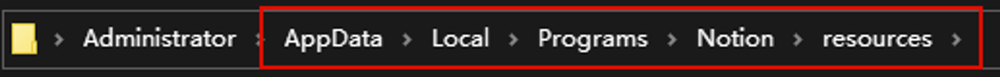
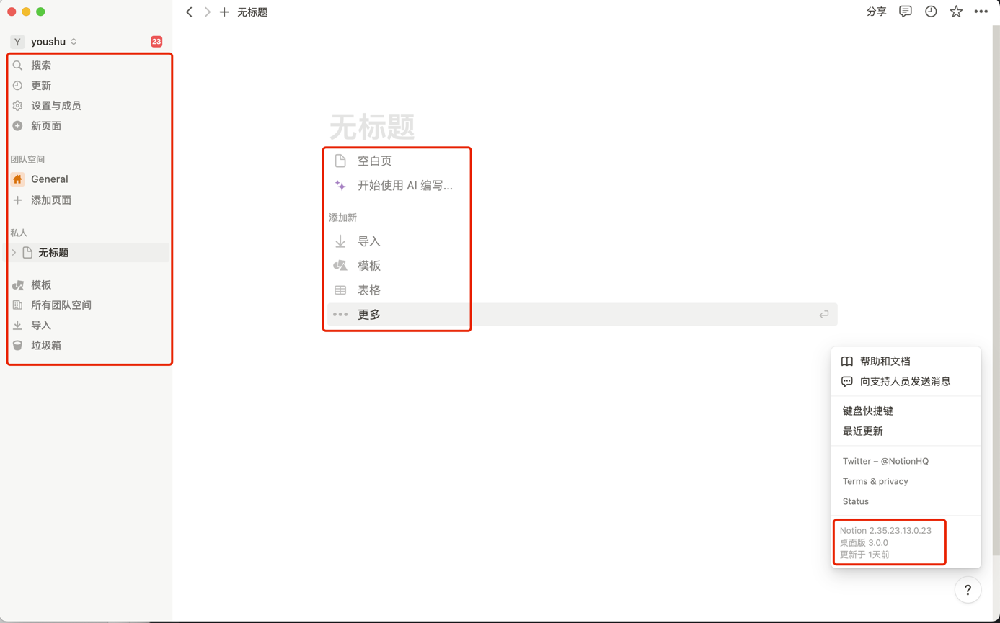

# notion客户端汉化（目前版本3.0.0）
> 最近notion桌面端更新了3.0.0版本后会导致老版本汉化失效，本项目实现了最新版Notion桌面端的汉化。
## 项目说明
- 本项目针对新的客户端做了汉化文化，依托的依然是`notion-zh_CN.js`。
- 因我这边只有`mac M系列`和`win`的电脑，3.0.0桌面端未做`mac intel`的汉化文件。
- 目前客户端版本：`3.0.0`。后续官方更新后会持续跟进汉化文件。
- 如果之前汉化过客户端，建议使用本项目前卸载重新安装一次。

## 汉化教程
### Win系统的Notion汉化方法
1. 下载`release`目录下对应win的`app.asar`文件。
2. `C盘` -> `"用户"文件夹` -> `当前用户名`【注意：保持和电脑用户名一致】。
3. 在以上路径后面加上`\AppData\Local\Programs\Notion\resources`，按回车打开`resources`文件夹（不要一个一个地打开文件夹，AppData是隐藏文件夹，直接找找不到）。

4. 把`resources`文件夹里的`app_update.yml`文件删掉。
5. 把下载的`app.asar`文件复制到`resources`文件夹，替换原本的【app.asar】文件。
6. 重启Notion应用程序即可。

### MacOS系统的Notion汉化方法
1. 因身边暂时没有`mac intel`的电脑，所以未做该版本的汉化文件。
2. 下载`release`目录下对应mac的`app.asar`文件。
3. 打开Finder-应用程序-notion-右键"显示内容包"-Contents-Resources。
4. 把`resources`文件夹里的`app_update.yml`文件删掉。
5. 把汉化包里面的`app.asar`文件复制到`resources`文件夹，覆盖原本的`app.asar`文件。
6. 重启Notion应用程序即可。

### 汉化效果

## 更新日志：
- 3.0.0 添加mac M芯片和win的汉化文件，实现Notion最新3.0.0客户端汉化。
- 2.x 添加各版本的汉化文件，实现Notion老版本【2.x】的客户端汉化。